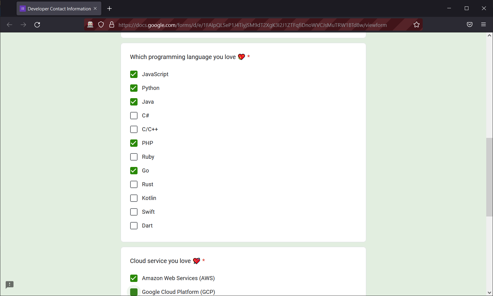

# Autofill Google Form with Selenium &amp; Python 




## Setup for Local Development

Local Environments = Python 3

1. Creating a virtual environment
```
py -m venv venv
```
2. Activate the environment
```
.\venv\Scripts\activate
```
3. Install all of the packages using requirements.txt
```
pip install -r requirements.txt
```
4. Run python script 
```
py main.py
```
6. Export a list of all installed packages (Optional)
```
pip freeze > requirements.txt
```
7. Leaving the environment
```
deactivate
```

## Reference Links
- https://packaging.python.org/en/latest/guides/installing-using-pip-and-virtual-environments/
- https://www.selenium.dev/
- https://www.selenium.dev/documentation/webdriver/
- https://selenium-python.readthedocs.io
